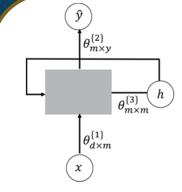

# Module 7

## Topic 1

### Lesson 1: Deep Learning CNN

Deep Learning
- deep neural networks learn hierarchical feature representations

Smaller Network: ANN
- we know it is good to learn a small model
- from this fully connected model, do we really need all the edges?
- can some of these be shared?
- when it comes to images, some patterns are much smaller than the whole image
  - can represent a small region (like the beak of a bird) with fewer parameters

Why CNN works well for images
- we can train a lot of "small" detectors and each detector must "move around"?

Can we use CNN for NLP?
- yes, but we do need to prepare a dataset which is readable to a CNN model like an image which is a matrix

How to prepare the dataset for an NLP problem?
- Let's say we have 3 documents collected from emails:
  - Wafa and Mahdi teach NLP class
  - NLP is neat
  - CNN is a good model
- Our vocabulary vector has 12 unique or distinct words; i.e. wafa, and, madhi, ...
- The longest document has 6 words (NOTE that CNN needs all datapoints to have the same size)

Applying One-Hot Encoding
- wafa = [1, 0, 0, 0, 0, 0, 0, 0, 0, 0, 0, 0]
- and = [0, 1, 0, 0, 0, 0, 0, 0, 0, 0, 0, 0]
- mahdi = [0, 0, 1, 0, 0, 0, 0, 0, 0, 0, 0, 0]
- ...
- each unique word will be a vector with a length equal to 12
- there are 12 unique words in our vocabulary vector

Convering Documents into a Matrix
- stack all of the one-hot encoding vectors till you have an n x d matrix where n is the number of words in the **longest** document and d is the number of unique words in the vocabulary
- all documents have the same size as the longest document in the corpus
- this is achieved by zero padding
- all documents can be converted the same way

### Lesson 2: Deep Learning CNN

Important Concept: A Convolutional Layer
- Now that all documents have the same size and are converted into a matrix form; we can start feeding them into a CNN model
- A CNN is a neural network with some convolutional layers (and some other layers)
- A convolutional layer has several filters that do the convolutional operation

Convolution vs Fully Connected
- CNN has fewer parameters!
- Shared weights

Max Pooling
- each filter is a channel
- the number of channels is the number of filters

Example
- original: 6x6
- convolutional layer: 4x4
  - feature engineering approach: creates richer input containing more information
- max pooling: 2x2
- flatten convoluted data and feed into fully connected feed forward network

Another Example:
- orig:  1 x 24 x 20
- conv: 25 x 22 x 18
- maxp: 25 x 11 x 9
- conv: 50 x  9 x  7
- maxp: 50 x  4 x  3
- flattened: 600

A CNN Compresses a Fully Connected Network in 3 Ways:
1. Reducing the number of connections
2. Shared weights on the edges
3. Max pooling further reduces the complexity

Example:
- `input_shape = (24, 20, 1)`: 24 x 20 matrix, 1 channel
- `Model2.add(Convolution2D(25, 3, 3))`: there are 25 3x3 filters

## Topic 2

### Lesson 1: Deep Learning RNN

Named Entity Recognition (NER) using RNN
- Example document: Mahdi and Wafa teach NLP
- Our simple NER model will detect whether each word is referring to a person or not. In our example, 1 refers to a person and 0, not a person
  | Mahdi | and | Wafa | teach | NLP |
  | --- | --- | --- | --- | --- |
  | 1 | 0 | 1 | 0 | 0 |
- For NER, the location of each word in a sentence is very important

Encode Each Word into a Vector
- we can use an encoding method to convert words into a vector (Word2Vec, GloVe, One-hot encoding, ...)
- Mahdi and Wafa Teach NLP >> each word $(x)$ will be a $d$ dimensional vector: $x \in \mathbb{R}^d$
- Output or prediction will be a neuron $O \in \mathbb{R}^m$
- the size of $y$ depends on our desired output
- for our NER problem, $y$ will be a scalar
- model parameters or weights $\theta_{dxm}$ ($d$: size of each vectorized word and $m$: number of hidden neurons)
- for each neuron ($x_i$), we have $m$ parameters

### Lesson 2: Deep Learning RNN

Let's go back to our NER problem using a Feed-Forward Approach
- $m$: number of hidden neurons is a **hyper-parameter** and needs to be optimized
- there are two sets of different parameters
  - (1) input to hidden layers: $\theta^1_{dxm}$
  - (2) hidden layers to output: $\theta^2_{mxy}$

RNN Concept to Connect Different Time Steps
- We introduced a new set of parameters ($\theta_{mxm}^3$) which generates a new vector of hidden neurons ($h_t$) with size $m$

Simple Representation of RNN
- rnn_units
- `tf.keras.layers.SimpleRNN(rnn_units)`

Forward Pass: How to Calculate Past Memory (h) in RNN

- $\theta^{(1)}$: weight (parameter) matrix associated with input data
- $\theta^{(2)}$: weight (parameter) matrix associated with output data
- $\theta^{(3)}$: weight (parameter) matrix associated with hidden state
- $h_t = f(x_t, h_{t-1}, \theta)$
  - $f$: activation function such as $tanh$ (hyperbolic tangent)
  - $x_t$: input
  - $h_{t-1}$: past memory (previous step)
  - $\theta$: model parameters (weight)
$h_t = \text{tanh}(x_t \theta^{(1)} + h_{t-1} \theta^{(3)} + b)$
    - each term will be a vector of size $m$
    - $b$ representes the bias vector here
- total number of parameters learned by model is $dxm + mxy + mxm$

Forward Pass: How to Calculate Output for Each Step ($\hat y$) in RNN:
- $\hat{y_t} = \text{softmax}(h_t \theta^{(2)})$
  - softmax scales the output between 0 and 1
  - the output of $h_t\theta^{(2)}$ will be a scalar for our NER problem

The complementary step to forward pass is backpropagation (Backproppagation through time (BPTT))

Different RNN Models
- **One-to-Many**: text generation; image captioning
- **Many-to-One**: sentiment classification
- **Many-to-Many**: part of speech tagging (POS), NER, translation, forecasting

Some Problems with RNN
- forward pass, backpropagation and repeated gradient computation can lead to two major issues
- **Exploding gradient** (high gradient values leading to very different weights in every optimization iteration)
  - Solution: gradient clipping (clip a gradient when it goes higher than a threshold)
- **Vanishing gradient** (low gradient values that stall the model from optimizing the parameters)
  - Solution: ReLu activation function
  - LSTM, GRUs (different architectures)
  - better weight initialization
- RNN suffers from short-term memory for a long sentence where words of interest may be palced far frome ach other in a sentence (vanishing gradient). Other architectures such as LSTM and GRUs can help with this

--------------------------------------

### Quiz 6

1. When we are using CNN for NLP, which of the following statements is **FALSE**?

> The input matrices of the CNN could be of different shapes.

2. Which of the following statements is **TRUE** about Convolutional Neural Networks (CNNs)?

> CNNs are typically used in tasks that require recognizing patterns in spatial data, like image and video analysis.

3. Which one of the following does **NOT** help to reduce the number of parameters in the Convolutional Neural Network?

> Sigmoid Activation function

4. Which of the following is **TRUE**?

> Exploding gradient problem is solved using gradient clipping (clip a gradient if it goes higher than a threshold)

5. Which of the following statements is **TRUE** about recurrent neural networks (RNNs)?

> RNNs are particularly suited for sequence prediction tasks because they have "memory" to capture information about what has been calculated before.

