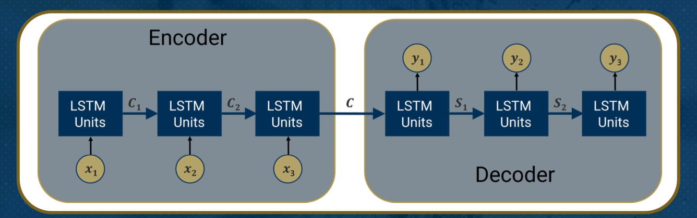

# Module 8

## Topic 1

### Lesson 1: Deep Learning LSTM (Part 1)

A Long-Term Dependency Example
- Fill in the blank model:
  - I was born in Japan and lived there for ten years, and then moved to the U.S. My native language is _____
    - RNN could suffer from a short memory issue in this example because of the vanishing gradient issue because of long dependencies between words to fill in the blank

Gated cell: Long Short-Term Memory (LSTM)
- the main concept is to add a "gate" to an RNN unit to control what information is passed through the network
- LSTM essentially augments the RNN unit by creating gates that allow some information to be passed on through the networka nd some to be forgotten
  - **LSTM is the leading algorithm used in sequential modeling**

How LSTM can control information removal and addition for cell state?
- This is called "gate" (the sigmoid operator) and controls how much information goes through
- The sigmoid layer scales numbers between zero and one
- A value of zero means do not let anything through (removal) and one means let all the information through (addition)

## Lesson 2: Deep Learning LSTM (Part 2)

GRU vs LSTM
- LSTM
  - forget state
  - input gate
  - output gate
  - cell state
- GRU
  - reset gate
  - update gate

Forget Gate Layer
- $f_t = \text{sigmoid}(x_t \theta^{\{input_f\}} + h_{t-1}\theta^{\{hidden_f\}} + b_f)$
  - OR
- $f_t = \sigma{sigmoid}(x_t \theta^{\{input_f\}} + h_{t-1}\theta^{\{hidden_f\}} + b_f)$
- $f_t$: forget gate's activation vector
- $\theta^{\{input}\}$: similar to RNN; the input matrix parameter has a size $dxm$
- $\theta^{\{hidden\}}$: similar to RNN, the hidden layer matrix parameter has a size $mxm$

Input Gate Layer to Update Cell State
- $i_t = \sigma(x_t \theta^{input_i} + h_{t-1}\theta^{\{hidden_i\}} + b_i)$
  - $i_t$: input / update gate's activation vector
- $\hat {C_t} = tanh(x_t \theta^{input_{\hat C}} + h_{t-1}\theta^{\{hidden_{\hat C}} + b_{\hat C})$
  - $\hat {C_t}: cell input activation vector$

Calculating the Output ($h_t$) Based on New $C_t$
- $o_t = \sigma(x_t \theta^{\{input_o\}} + h_{t-1}\theta^{\{hidden_o\}} + b_o)$
  - $o_t$: output gate's activation vector
- $h_t = o_t * tanh(C_t)$
  - $h_t$: hidden state vector also known as output vector of the LSTM unit

GRU Update and Reset Gates
- **Update Gate**: the update gates acts similar to the forget and input gate of an LSTM. It decides what information to throw away and what new information to add
- **Reset Gate**: the reset gate is another gate that is used to decide how much past information to forget

## Topic 2

### Lesson 1: Deep Learning LSTM + Attention

Language Translation Example
- *Let's say we are going to translate "How are you" from English to Polish:*
  - English: How are you
  - Polish: jak się maz
- Use LSTM units to perform this task

RNN and LSTM Units
- LSTM essentially augments the RNN unit by creating gates that allow some information to be passed on through the network and some to be forgotten
- RNN unit: `tf.keras.layers.SimpleRNN(rnn_units)`
- LSTM unit: `tf.keras.layers.LSTM(lstm_units)`

Encoder and Decoder

- $C_i$: encoder state
- $C$: final eencoder state which is sent to a decoder
- $S_i$: decoder state

Attention Mechanism
- attention parameters are attached to each encoder LSTM units
- we need to know the weights associated with each attention

--------------------------------------

### Quiz 7

1. Which of the following statements is true about Long Short-Term Memory (LSTM)?

> LSTM networks are specifically designed to avoid the long-term dependency problem, which is the issue of learning to connect information with a gap between relevant information and the point where it is needed

2. In LSTM, the new cell state vector is NOT affected by

> output gate

3. How many gates are present in an LSTM architecture?

> 2

4. Which of the following major gates are presentin GRU?

> Reset Gate, Update Gate

5. What is the main disadvantage of not using Attention in encoder-decoder architecture?

> - [x] Information Loss due to a single vector representation from the encoder
> - [ ] Information Loss due to a single vector representation from the decoder
> - [x] Deciphering complexity on the decoder side
> - [ ] Deciphering complexity on the encoder side

